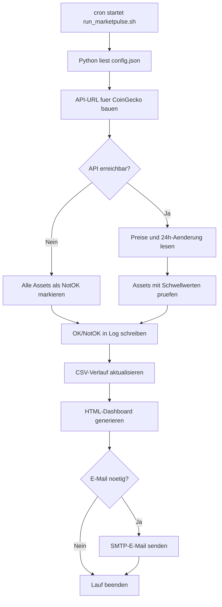

# MarketPulse LB3 Projekt

MarketPulse ist ein WSL-taugliches Python-Projekt, das Marktkurse automatisch ueber eine API abruft und als HTML-Dashboard darstellt. Das Projekt ist fuer cron vorbereitet, schreibt OK/NotOK-Log-Dateien und kann den Benutzer per E-Mail informieren.

## Projektidee

Das Programm ueberwacht mehrere Kryptowaehrungen wie Bitcoin, Ethereum, Solana und Cardano. Bei jedem Lauf werden aktuelle Preise und 24h-Aenderungen von CoinGecko abgefragt. Danach bewertet MarketPulse jeden Kurs nach Regeln in `config.json`:

- `OK`: Preis wurde erfolgreich abgerufen und der Kursverlust ist nicht unter dem Grenzwert.
- `NotOK`: API-Fehler, fehlender Preis oder Kursverlust unter dem definierten Grenzwert.

Die Ergebnisse werden in `logs/marketpulse.log`, `data/market_history.csv` und `reports/index.html` gespeichert.

## Erfuellte LB3-Anforderungen

- Grafisch dargestellt: `reports/index.html` zeigt Statuskarten, Kursfilter und ein zoombares Chart mit Kursverlauf.
- Detailliert kommentiert: `src/marketpulse.py` enthaelt Docstrings und erklaerende Kommentare.
- Funktionen, Arrays, Schleifen: Der Code verwendet klare Funktionen, Listen wie `assets` und Schleifen ueber alle Marktkurse.
- Regelmaessig gestartet: `run_marketpulse.sh` ist fuer cron in WSL vorbereitet.
- Automatisch protokolliert: OK und NotOK werden in `logs/marketpulse.log` und CSV gespeichert.
- Benutzer informiert: SMTP-E-Mail ist eingebaut und wird ueber Umgebungsvariablen aktiviert.

## Ablaufdiagramm



## Projektstruktur

```text
MarketPulse/
  config.json              Einstellungen, Assets, Schwellwerte, E-Mail
  run_marketpulse.sh       Startskript fuer WSL und cron
  requirements.txt         Hinweis: keine externen Python-Pakete noetig
  src/marketpulse.py       Hauptprogramm
  data/market_history.csv  Wird automatisch erzeugt
  logs/marketpulse.log     Wird automatisch erzeugt
  reports/index.html       Wird automatisch erzeugt
```

## WSL Setup

Im WSL-Terminal in den Projektordner wechseln. Wenn das Projekt im Windows-Ordner liegt, ist der Pfad ungefaehr:

```bash
cd /mnt/c/Users/nicos/Desktop/TBZ/Haraldabi/MarketPulse
```

Startskript ausfuehrbar machen:

```bash
chmod +x run_marketpulse.sh
```

Manueller Testlauf:

```bash
./run_marketpulse.sh
```

Dashboard oeffnen:

```bash
explorer.exe reports/index.html
```

Im Dashboard kannst du auf eine Kurskarte oder einen Kurs-Button klicken. Dann zeigt das Diagramm nur diese eine Linie. Mit Mausrad oder Touchpad kannst du in das Diagramm zoomen, mit `Shift` + Ziehen verschiebst du den Ausschnitt und mit `Zoom zuruecksetzen` wird die Ansicht wieder normal.

## cron Automatisierung

crontab oeffnen:

```bash
crontab -e
```

Beispiel: alle 15 Minuten starten und cron-Ausgabe separat protokollieren:

```cron
*/15 * * * * /mnt/c/Users/nicos/Desktop/TBZ/Haraldabi/MarketPulse/run_marketpulse.sh >> /mnt/c/Users/nicos/Desktop/TBZ/Haraldabi/MarketPulse/logs/cron.log 2>&1
```

Pruefen, ob cron laeuft:

```bash
sudo service cron status
```

Falls cron nicht laeuft:

```bash
sudo service cron start
```

## E-Mail Benachrichtigung

In `config.json` ist E-Mail aus Sicherheitsgruenden zuerst deaktiviert:

```json
"email": {
  "enabled": false,
  "send_when": "notok"
}
```

Zum Aktivieren auf `true` setzen und im WSL-Terminal Umgebungsvariablen setzen. Beispiel fuer Gmail mit App-Passwort:

```bash
export MARKETPULSE_SMTP_USER="dein.name@gmail.com"
export MARKETPULSE_SMTP_PASSWORD="dein-app-passwort"
export MARKETPULSE_ALERT_TO="empfaenger@example.com"
export MARKETPULSE_ALERT_FROM="dein.name@gmail.com"
```

Damit cron diese Variablen kennt, koennen sie oben in die crontab eingetragen werden:

```cron
MARKETPULSE_SMTP_USER=dein.name@gmail.com
MARKETPULSE_SMTP_PASSWORD=dein-app-passwort
MARKETPULSE_ALERT_TO=empfaenger@example.com
MARKETPULSE_ALERT_FROM=dein.name@gmail.com
*/15 * * * * /mnt/c/Users/nicos/Desktop/TBZ/Haraldabi/MarketPulse/run_marketpulse.sh >> /mnt/c/Users/nicos/Desktop/TBZ/Haraldabi/MarketPulse/logs/cron.log 2>&1
```

## Anpassungen

Weitere Assets koennen in `config.json` hinzugefuegt werden. Die `id` muss der CoinGecko-ID entsprechen.

```json
{
  "id": "ripple",
  "symbol": "XRP",
  "name": "XRP",
  "notok_drop_percent": -7.0
}
```

Der Wert `notok_drop_percent` bestimmt, ab welchem 24h-Verlust ein Asset als `NotOK` gilt.

## Bewertungsidee fuer die Praesentation

- Zeige zuerst das Ablaufdiagramm.
- Starte dann `./run_marketpulse.sh` in WSL.
- Oeffne `reports/index.html` und zeige Statuskarten und Chart.
- Oeffne `logs/marketpulse.log` und zeige OK/NotOK-Zeilen.
- Erklaere danach `config.json`, weil dort Arrays und Grenzwerte sichtbar sind.
